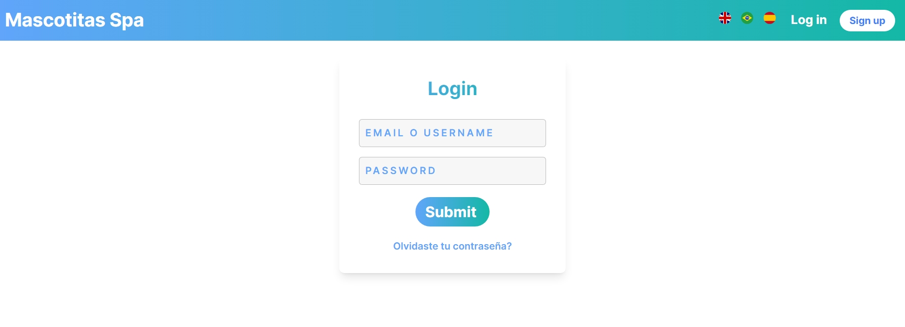

# Spa to Pet BR

É um clone do projeto Pet Spa (https://github.com/diazgio/Petspa) criado por Giordano Díaz de Lima-Peru, GitHub ==> https://github.com/diazgio, X ==> @giordano\*diaz; veja playlist (https://www.youtube.com/watch?v=S0sMUK2Y-Lk&list=PLofURAiX_gqROw9ya19AYZIfDS5ZJRIA_) no youtube com todas as aulas, demonstrando o desenvolvimento do projeto.

A escolha do projeto baseou-se em sua relevância para as tecnologias e conceitos que estou atualmente aprendendo.

Após clonar o repositório, comecei analisando a estrutura do projeto, os principais arquivos e diretórios, e a lógica implementada. Estudei os diferentes componentes, serviços e fluxos de dados para compreender como tudo estava integrado.

Com o entendimento básico do projeto, comecei a fazer algumas modificações para adaptar o código às minhas idéias. As modificações incluíram:

- Inclusão da opção de Idiomas(english, portugues e spanish). OBS: 90% traduzido
- Funcionalidade de aprovação de pagamento.
- Atualização do status do agendamento pelo admin, somente com status de pagamento aprovado.
- Ajuste de layouts para algumas views
- Inclusão do codigo de agendamento, e pesquisa por codigo de agendamento.
- Inclusão de envio de email para determinadas funcionalidades.

O foco do sistema é gerenciar o agendamento de serviços, o pagamento destes, e o andamento dos serviços.

Principais Características e Funcionalidades

- O sistema tem funcionalidades para área administrativa e de cliente.
  #### Administrativa
        - Cadastro de Local, Cidade, Serviços, Lista de Agendamentos, Aprovação de pagamento, Alteração Status do agendamento.
  #### Cliente
        - Cadastro Pet, Agendamento, Comprovante de pagamento

#### Algumas regras de negócio

- Acesso as funcionalidades, somente autenticado.
- Registro de usuario, sera somente com papel de cliente.
- A atualização do status do agendamento pelo administrador, somente com status de pagamento como aprovado.
- A data/hora de finalização do serviço não pode ser menor que da data/hora de inicio do serviço.
- O Cliente so poderá incluir o comprovante de pagamento, com status de pagamento como pendente.
- O idioma default esta configurado para portuguese do Brasil.

## Algumas Views

. Welcome Index

. Login

. Dashboard Admin

. Lista de Agendamento para aprovação

. Lista das cidades cadastradas

. Cadastro tabela Local

. Dashboard Cliente

. Escolha do serviço

. Cadastro Agendamento Serviço

. Lista de Pets

. Cadastro de Pets

## Como iniciar o projeto

Para executar esse projeto você deve ter um computador, preferencialmente com
Linux, com a linguagem de programação Ruby na versão 3.3.0, Ruby on Rails 7.1.3 e Postgresql

Dentro do diretório do projeto, você deve instalar as dependências definidas no
arquivo `Gemfile` com o comando `bundle install`.
OBS: Estou usando a gem dotenv-rails, então e necessario ajustar o config/database.yml; de acordo com suas configurações do banco de dados Postgresql.

Criação da base de dados

- rails db:create
- rails db:migrate
- rails db:seed  
   OBS: Caso não queira popular a base dados, NÃO executar "rails db:seed", será necessario criar um usuario com perfil admin, desta forma :
  - rails c
  - User.create(first_name: 'Tester1', last_name: 'Tester', email: 'tester1@test.com',
    user_name: '@tester', phone: '12345677793', password: '123456', role: 'admin')

Com todas dependências instaladas, execute `rails server` e acesse
`http://localhost:3000` em seu navegador.

Login com

- email => tester1@test.com password => 123456 ou
- email => tester2@test.com password => 123456 (este somente se foi executado rails db:seed)

## Executando os testes

Com todas dependências instaladas, como descrito na seção anterior, em seu
terminal execute

- `bundle exec rspec`.
- OBS: Cobertura de testes de apenas 57%

  #### OBS: Os testes estão configurados para o idioma "english" (:en) configurado no spec_helper.rb, pois o meu default é "portuguese" (:pt-BR)

      RSpec.configure do |config|
        config.before(:each) do
          I18n.locale = :en
        end

        config.after(:each) do
          I18n.locale = I18n.default_locale
        end
      end
